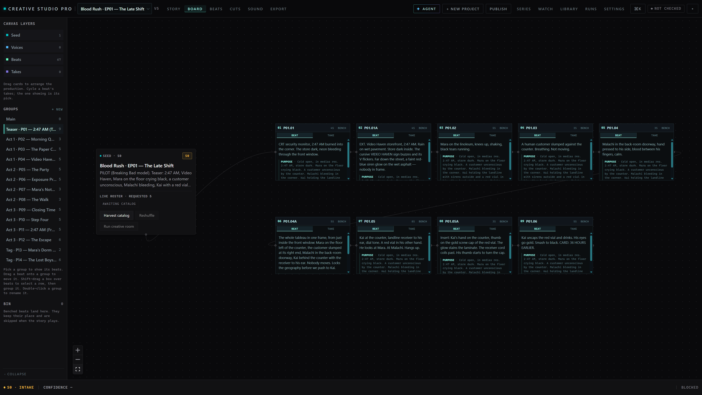

# Creative Studio Pro

Creative Studio Pro is a canvas-first studio for short films and trailers: story beats on a spatial board, generated takes on each beat, and saved cuts you trim and finish.

**Stack**

- SvelteKit and Svelte 5, with Svelte Flow for the canvas
- Vercel AI SDK for in-app Agent chat
- Higgsfield (Seedance 2.0 / 2.5) for image and video generation
- Notion import for series and episode outlines
- WebGPU resident frame banks for clip preview and filmstrips
- Bun, Vite, Tailwind CSS

Service URLs and API keys use environment variables (see `.env.example`); set values in your local `.env.local` (git-ignored).

**What it does**

- Plan and connect beats on a board; attach multiple takes per beat and pick one for the spine
- Push selections into named cuts with trims and speed ramps; lock a cut when picture is set
- Import structured episode data from Notion when you already maintain shots there
- Run generation only after stage gates, a live credit quote, and explicit confirm
- Preview takes with WebGPU-backed frame banks where the browser supports it

Founding documents (read both before writing code):

- `docs/planning/prds/prd-creative-studio-pro-2026-08-22/prd.md`
  — canonical product requirements, donor blend map, workflows, data
  model, architecture, phases.
- `docs/planning/ux-designs/ux-creative-studio-pro-2026-08-22/DESIGN.md`
  — canonical visual identity and tokens.
- `docs/planning/ux-designs/ux-creative-studio-pro-2026-08-22/EXPERIENCE.md`
  — canonical behavior, states, interactions, accessibility, and flows.
- `docs/planning/architecture/architecture-creative-studio-pro-2026-08-22/ARCHITECTURE-SPINE.md`
  — canonical architecture invariants and dependency rules.

Index: [docs/planning/README.md](docs/planning/README.md). Implementation
specs: [docs/implementation/](docs/implementation/).

Rules (inherited from creative-studio-os and the bridge):

1. Reuse over rebuild — donor repos are called, not forked.
2. No fabricated model output; answers are stored verbatim with provenance.
3. Generation is always gated: approve → live quote → explicit confirm.
4. Bun for JS, uv for Python. No npm/npx — use `bun` / `bunx` (including `bunx skills@latest` for Matt Pocock skills).
5. Do not use gpt-5.5 for agent work on this project.

Agent skills: Matt Pocock engineering set in `.agents/skills/` (see `skills-lock.json`, `AGENTS.md`). After clone: `bun install` links `.claude/skills/`. Refresh skills: `bun run skills:install`.
