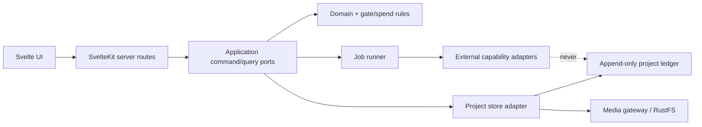
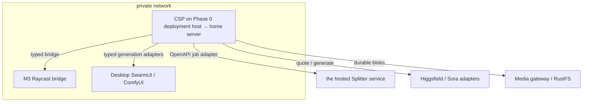

# Architecture Spine — Creative Studio Pro

## Design Paradigm

**Local-first hexagonal modular monolith.**

- `src/lib/domain/` — entities, commands, events, gates, spend, provenance.
- `src/lib/application/` — use cases and ports; only mutation entry point.
- `src/lib/adapters/` — project store, media store, Raycast, Splitter,
  desktop generation, Higgsfield/Sora, operations read model.
- `src/routes/` — SvelteKit UI and server endpoints; no domain ownership.



Dependencies point inward. Adapters may depend on application ports and domain
schemas; domain/application never import adapters or Svelte routes.

## Invariants & Rules

### AD-1 — One orchestration boundary [ADOPTED]

- **Binds:** all browser/service interactions; NFR-004..007
- **Prevents:** browser code independently calling providers or leaking secrets.
- **Rule:** The browser calls same-origin SvelteKit server routes only. Every
  external call is made by an adapter behind an application port.

### AD-2 — Project folder is the aggregate [ADOPTED]

- **Binds:** FR-001..004, FR-027..032; NFR-001..003
- **Prevents:** multiple canonical stores and unrecoverable derived indexes.
- **Rule:** One project folder owns canonical append-only JSONL records and
  project media references. Any index/cache is disposable and rebuildable.

### AD-3 — Single mutation gateway

- **Binds:** all project-changing epics.
- **Prevents:** routes, workers, and UI independently mutating shared files.
- **Rule:** Every canonical mutation is a typed command through one project
  command gateway with project version precondition, atomic append, and returned
  version. Canvas layout is a separate low-contention document written through
  the same gateway using last-writer-wins and no aggregate version precondition;
  it may never contain canonical domain/audit records.

### AD-4 — Versioned boundary schemas

- **Binds:** persisted records, API payloads, external adapter requests/results.
- **Prevents:** incompatible shapes that parse differently by feature.
- **Rule:** Zod 4 schemas carry explicit `schema_version`; unknown versions fail
  closed. Do not use Zod 3 compatibility imports or v3 error-customization
  idioms. Migrations are explicit, forward-only, and preserve source records.
  Persisted entity shapes—including SceneSegment and Storyboard—live in domain;
  adapters map external manifests into them and own no persisted entity shape.

### AD-5 — Capability adapters own machines/providers [ADOPTED]

- **Binds:** FR-005..009, FR-016, FR-025..026, FR-032.
- **Prevents:** features bypassing M3/desktop/Splitter/provider boundaries.
- **Rule:** Each external capability implements `health`, `capabilities`, and
  typed operations. Health/capability checks use non-billable endpoints only;
  quote/generate endpoints are never probes. Offline/degraded state disables
  only its operations; no adapter may invoke another adapter as fallback. The
  Splitter adapter consumes only `/api/health` and `/api/jobs*`; its image-split,
  reviews, projects, and integrations routes are outside CSP v1.

### AD-6 — One idempotent job state machine

- **Binds:** Creative Room, Splitter, character sheets, generation, extension.
- **Prevents:** duplicate spend, incompatible status names, lost restart state.
- **Rule:** Long work uses `queued → running → succeeded | failed | cancelled`,
  stable job ID, idempotency key, external correlation ID, attempts, timestamps,
  and append-only transitions inside the owning project folder. The in-memory
  runner queue is disposable and rebuilt from those records after restart.
  Creative Room uses one job per voice with idempotency key
  `run_id + exact_catalog_label`; any bridge batch is adapter-internal. Restart
  resumes/reconciles and never re-submits without a new operator command.

### AD-7 — super-seed2 gate engine is authoritative [ADOPTED]

- **Binds:** FR-003..004, FR-012, FR-022..023.
- **Prevents:** independent features interpreting S0–S10 differently.
- **Rule:** One gate module evaluates stage prerequisites and legal actions from
  project events. Operator-only force-advance and pilot/batch eligibility are
  immutable audit events; adapters cannot bypass the module. Ad-hoc
  character-sheet tasks link at S6 and never mutate or force-advance parent
  stage state. Offline CI and stories use the vendored
  `METHODOLOGY-CONTRACT.md` baseline; credentialed agents also verify the live
  private super-seed2 repository before changing methodology behavior.

### AD-8 — Quote confirmation is a spend authorization [ADOPTED]

- **Binds:** FR-015, FR-023..025; NFR-017.
- **Prevents:** confirmation authorizing a changed prompt/model/cost.
- **Rule:** Confirmation references one unexpired quote containing provider,
  exact model, prompt hash, amount/currency-or-credits, and expiry. Any mismatch
  or pre-dispatch expiry requires a new quote and confirmation. Once a provider
  accepts a dispatched job, that confirmation authorizes its full recorded
  lifecycle; later quote expiry never cancels/re-submits an in-flight job.

### AD-9 — Provenance is first-class [ADOPTED]

- **Binds:** FR-006, FR-010..013, FR-020..030; NFR-001..002, NFR-010.
- **Prevents:** artifacts losing the exact input/model/gate chain that made them.
- **Rule:** Catalogs, briefs, prompts, answers, jobs, quotes, confirmations,
  artifacts, and specs have stable IDs and content hashes. Derived records name
  parent IDs and methodology source commit. Hash mismatch blocks promotion.

### AD-10 — Raycast catalog snapshots determine rosters [ADOPTED]

- **Binds:** FR-005..013; NFR-009..010.
- **Prevents:** static model enums and irreproducible random selection.
- **Rule:** Each run persists the M3-returned exact catalog, catalog hash,
  selection seed, requested count, selected labels, and operator overrides.
  Randomization reads only that snapshot.

### AD-11 — Durable media uses stable asset identities

- **Binds:** SourceVideo, CharacterSheet, SceneSegment, Artifact, SpecCard.
- **Prevents:** canonical records depending on temporary provider/CDN URLs.
- **Rule:** Accepted/downloadable media enters through one media-store ingest
  port, which computes canonical byte hash and persists asset ID, bucket/object
  key, MIME type, and dimensions/duration. Capability adapters return
  bytes/metadata and never persist media directly. Provider URLs remain
  provenance metadata only. Persisted filesystem paths are project-relative;
  absolute roots exist only in runtime config.

### AD-12 — Server state is canonical; client state is projection

- **Binds:** canvas, inspector, compare, runs, library, capability UI.
- **Prevents:** Svelte stores becoming a second project database.
- **Rule:** Svelte runes/stores hold view state and optimistic command state.
  Successful server command results replace projections; reload reconstructs
  from server queries and persisted canvas layout.

### AD-13 — Operations read without ownership [ADOPTED]

- **Binds:** FR-031 and creative-studio-os integration.
- **Prevents:** digest/Linear/Discord jobs mutating project truth.
- **Rule:** One read-model/index builder lives in the project-store adapter.
  UI queries and operations projections consume its versioned outputs; neither
  rebuilds/defines competing meanings for stage, due, stalled, or approved.
  Operations may link projects/artifacts but cannot write project/gate records.

### AD-14 — Private deployment, portable runtime [ADOPTED]

- **Binds:** Phase 0 Phase 0 deployment host deployment and home-server target.
- **Prevents:** host-specific paths/config forcing a feature rewrite on migration.
- **Rule:** Phase 0 binds privately on the private network. Runtime config, project root,
  media adapter, and capability endpoints are environment-injected. The same
  build artifact and store contract deploy on Phase 0 deployment host or the home server.

### AD-15 — Verification is a release boundary [ADOPTED]

- **Binds:** NFR-008..018 and every build story.
- **Prevents:** individually green units that violate shared contracts.
- **Rule:** Required gates are schema/contract tests, project restart recovery,
  gate/spend/provenance invariants, adapter fake tests, and browser checks at
  1440px/375px. Real integration tests run only against explicitly configured
  services and never fabricate success.

### AD-16 — Service resilience envelope

- **Binds:** NFR-006, all external adapters and jobs.
- **Prevents:** independently chosen hangs/retries and duplicate mutation/spend.
- **Rule:** Defaults are connect ≤10s, synchronous request ≤120s, submit/quote
  request ≤60s, poll request ≤30s, and max 3 retries with exponential backoff
  for idempotent health/GET calls only. Async adapters declare an operation
  deadline (default 1800s). Mutating calls are never blindly retried; they reuse
  the same idempotency key and reconcile outcome. Deadline expiry appends a
  terminal failed transition.

## Consistency Conventions

| Concern | Convention |
|---|---|
| IDs | UUIDv7 strings; never array position/display label |
| Time | UTC RFC3339 strings; durations in integer milliseconds; frames remain integers |
| Events | `domain.entity.action.v1`; append-only envelope with event/job/project IDs |
| Commands | Verb-first Zod payload; project ID + expected version + idempotency key |
| Errors | `{code, message, retryable, source, details?}`; preserve external message separately |
| Files | kebab-case; schemas/types PascalCase; functions/fields camelCase |
| Secrets | Server env only; BWS is an ops-side injection mechanism and is never imported by domain/application; redact logs |
| Config | Explicit environment schema at startup; fail closed on missing required values |
| Tooling | Bun only for JS/TS; uv for any Python tooling/service; no npm |
| Logging | Structured JSON with request/job/project correlation IDs; no prompt/raw-secret logging |
| Auth | Phase 0 private network boundary; no public listener. Public auth is deferred. |

## Stack

Verified 2026-08-22; lockfile/code owns versions after scaffold.

| Name | Version |
|---|---:|
| Bun | 1.3.14 |
| Svelte | 5.56.10 |
| SvelteKit | 2.70.3 |
| Tailwind CSS | 4.3.3 |
| @xyflow/svelte | 1.6.3 |
| Zod | 4.4.3 |
| @sveltejs/adapter-node | 5.5.7 |
| uv | 0.11.16 |

Starter: official `sv create` SvelteKit project, TypeScript, adapter-node,
Tailwind integration, Bun lockfile. Do not add React.

## Structural Seed

```text
creative-studio-pro/
  src/
    lib/
      domain/          # entities, events, gates, spend, provenance schemas
      application/     # commands, queries, ports, job orchestration
      adapters/        # project/media stores + external capabilities
      ui/              # Svelte components, nodes, panels, view projections
    routes/
      api/             # thin same-origin server routes
      (app)/           # canvas, library, runs, settings
  data/projects/       # configurable project root; gitignored
  tests/
    contracts/
    domain/
    integration/
    browser/
```



## Capability → Architecture Map

| Capability / Area | Lives in | Governed by |
|---|---|---|
| FR-001..004 Project/canvas/gates | domain + project-store + ui | AD-2, AD-3, AD-7, AD-12 |
| FR-005..013 Creative Room | raycast adapter + jobs + voice UI | AD-5, AD-6, AD-9, AD-10 |
| FR-014..015 Character sheets | character domain + generation adapter | AD-6, AD-7, AD-8, AD-11 |
| FR-016..019 Split/extend | splitter adapter + segment domain + jobs | AD-5, AD-6, AD-11 |
| FR-020..028 Trailer/generation | trailer/gate/spend/provenance domain | AD-7, AD-8, AD-9 |
| FR-029..032 Library/ops/capabilities | spec store + ops projection + health ports | AD-5, AD-11, AD-13 |
| NFR-001..010 Integrity/security/contracts | all server modules | AD-1..11 |
| NFR-011..018 UX/performance/spend | UI + browser tests + spend domain | AD-8, AD-12, AD-15 |

## Deferred

- Public/Vercel exposure and user authentication — revisit before any non-private network
  listener or second user.
- SQLite/Postgres — revisit when one project needs concurrent writers or file
  ledger/index rebuild no longer meets measured needs.
- Queue infrastructure — revisit when in-process durable job reconciliation
  cannot survive deployment/restart requirements.
- Metrics/alerting backend — structured correlated logs are required now;
  choose centralized metrics/alerts when Phase 0 measurements show an operator
  need, without allowing feature modules to invent separate telemetry stacks.
- Home-server cutover procedure, backups, and service supervision — operations
  story after Phase 0 behavior passes on Phase 0 deployment host.
- Audio/NLE architecture — outside v1 non-goals.
